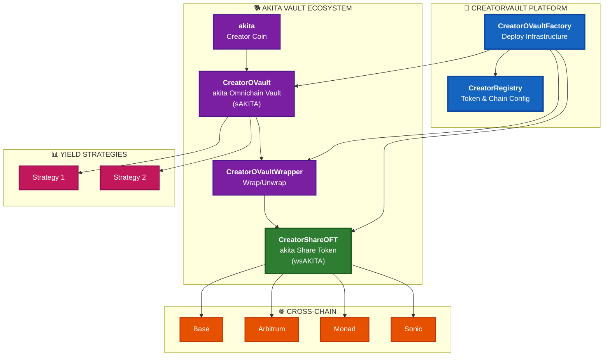

# CreatorVault

> **Omnichain Vault Platform for Creator Coins** - Enable any creator to launch cross-chain yield vaults for their tokens

[](LICENSE)
[](https://docs.soliditylang.org/)
[](https://layerzero.network/)
[](#multi-chain-support)

## Overview

CreatorVault is a **vault-as-a-service platform** for Creator Coins (Coinbase Creator Economy). Any creator can deploy battle-tested vault infrastructure for their token, enabling:

- **Yield generation** through customizable strategies
- **Cross-chain transfers** via LayerZero OFT
- **Buy fees** with lottery integration for community engagement
- **Deterministic deployment** - same addresses across all chains

### Inspired By

- **Creator Coins** (Coinbase) - Token standard for creators
- **FriendTech** - Social-fi mechanics and engagement
- **Yearn V3** - Battle-tested vault architecture

## Key Features

- **🎨 Creator-First**: Each creator deploys their own vault ecosystem
- **🌐 Omnichain**: LayerZero V2 enables cross-chain share transfers
- **📈 Yield Strategies**: Pluggable strategy system for yield generation
- **💰 Buy Fees**: 6.9% default fee on DEX purchases → GaugeController
- **🎰 Lottery**: Automated lottery entries for token buyers
- **🔒 Security**: Anti-inflation attacks, flash loan protection, whale guards
- **🏭 Factory**: One-click deployment of vault + wrapper + OFT

## Architecture



## Token Flow

```
Creator Coin (akita) → Deposit → CreatorOVault (sAKITA shares)
                                       ↓
                              CreatorOVaultWrapper
                                       ↓
                              CreatorShareOFT (wsAKITA)
                                       ↓
                              Bridge to any chain via LayerZero
```

## Multi-Chain Support

| Network | Chain ID | LZ EID | Status | Explorer |
|---------|----------|--------|--------|----------|
| **Base** | 8453 | 30184 | 🟢 Hub Chain | [BaseScan](https://basescan.org) |
| **Ethereum** | 1 | 30101 | 🔄 Configured | [Etherscan](https://etherscan.io) |
| **Arbitrum** | 42161 | 30110 | 🔄 Configured | [Arbiscan](https://arbiscan.io) |
| **BSC** | 56 | 30102 | 🔄 Configured | [BscScan](https://bscscan.com) |
| **Avalanche** | 43114 | 30106 | 🔄 Configured | [SnowTrace](https://snowtrace.io) |
| **Monad** | 10143 | 30390 | 🔄 Configured | [MonadExplorer](https://monadexplorer.com) |
| **Sonic** | 146 | 30332 | 🔄 Configured | [SonicScan](https://sonicscan.org) |
| **HyperEVM** | 999 | 30275 | 🔄 Configured | [Hyperliquid](https://hyperliquid.xyz) |

## Quick Start

### Prerequisites

- **Node.js** 18+ with pnpm
- **Foundry** for Solidity development

### Installation

```bash
# Clone the repository
git clone https://github.com/wenakita/CreatorVault.git
cd CreatorVault

# Install dependencies
pnpm install

# Run tests
forge test
```

## Project Structure

```
CreatorVault/
├── contracts/
│   ├── core/                     # Core platform contracts
│   │   └── CreatorRegistry.sol
│   ├── vault/                    # Vault contracts
│   │   ├── CreatorOVault.sol
│   │   └── CreatorOVaultWrapper.sol
│   ├── layerzero/                # Cross-chain (LayerZero)
│   │   └── CreatorShareOFT.sol
│   ├── governance/               # Governance & tokenomics
│   │   ├── CreatorGaugeController.sol
│   │   └── veAKITA.sol
│   ├── factories/                # Deployment factories
│   │   └── CreatorOVaultFactory.sol
│   ├── strategies/               # Yield strategies
│   │   └── BaseCreatorStrategy.sol
│   ├── lottery/                  # Lottery system
│   │   └── CreatorLotteryManager.sol
│   ├── vrf/                      # Chainlink VRF
│   │   └── CreatorVRFConsumerV2_5.sol
│   ├── oracles/                  # Price oracles
│   │   └── CreatorChainlinkOracle.sol
│   ├── lp/                       # LP management
│   ├── hooks/                    # Uniswap V4 hooks
│   ├── helpers/                  # Utility contracts
│   └── interfaces/               # All interfaces (mirrored structure)
│       ├── core/
│       ├── strategies/
│       ├── lp/
│       ├── oracles/
│       └── external/
├── frontend/                     # UI components
├── deployments/                  # Deployment addresses
└── README.md
```

## Core Contracts

### CreatorOVault

ERC-4626 compliant vault for Creator Coins with:

- **Yearn V3 Features**: Profit unlocking, strategy queues, debt purchasing
- **Security**: Virtual shares offset, flash loan protection, large withdrawal queue
- **Flexibility**: Multi-strategy support, configurable fees

```solidity
// Deploy via factory
(vault, wrapper, shareOFT) = factory.deployCreatorVault(
    0x5b67...75,                    // akita token
    "akita Omnichain Vault",        // vault name
    "sAKITA",                      // vault symbol
    "akita Share Token",            // OFT name
    "wsAKITA",                   // OFT symbol
    "base",                         // chain prefix
    msg.sender                      // creator address
);
```

### CreatorShareOFT

LayerZero OFT with social-fi features:

- **Buy Fee**: 6.9% on DEX purchases → GaugeController
- **Lottery**: Automatic entries for buyers
- **Minting**: Only wrapper can mint/burn

```solidity
// Register DEX pools
shareOFT.setAddressType(uniswapPool, OperationType.SwapOnly);

// Set fee recipient
shareOFT.setGaugeController(gaugeController);
```

### CreatorRegistry

Central registry for the platform:

- **Creator Coins**: Register tokens and their vault/OFT addresses
- **Chain Config**: LayerZero endpoints, DEX infrastructure
- **Ecosystem**: Lottery managers, gauge controllers, gas reserves

```solidity
// Register a new Creator Coin
registry.registerCreatorCoin(
    tokenAddress,
    "akita",
    "akita",
    creatorAddress,
    poolAddress,
    3000  // 0.3% fee tier
);
```

## Usage

### For Creators

1. **Deploy Infrastructure**
```solidity
factory.deployCreatorVault(
    creatorCoinAddress,
    "MyToken Omnichain Vault",
    "mtOV",
    "MyToken Share Token",
    "stkmMT",
    "base",
    creatorAddress
);
```

2. **Configure DEX Pools** (for buy fee)
```solidity
shareOFT.setAddressType(uniswapPool, OperationType.SwapOnly);
```

3. **Add Yield Strategies**
```solidity
vault.addStrategy(strategyAddress, 5000); // 50% allocation
```

### For Users

1. **Deposit Creator Coins**
```solidity
vault.deposit(1000e18, msg.sender); // Get vault shares
```

2. **Wrap for Cross-Chain**
```solidity
wrapper.wrap(shareAmount); // Get ShareOFT tokens
```

3. **Bridge via LayerZero**
```solidity
shareOFT.send(sendParams, fee, refundAddress);
```

## First Deployment: akita

The first Creator Coin to use CreatorVault:

| Item | Value |
|------|-------|
| **Creator Coin** | `akita` |
| **Token Address** | `0x5b674196812451b7cec024fe9d22d2c0b172fa75` |
| **Network** | Base |
| **DEX Pair** | akita/ZORA |
| **Fee Tier** | 3% (Uniswap V4) |
| **Vault Name** | akita Omnichain Vault |
| **Vault Symbol** | sAKITA |
| **OFT Name** | akita Share Token |
| **OFT Symbol** | wsAKITA |

## Security Features

### Anti-Inflation Attack
- Virtual shares offset (1e3)
- Minimum first deposit (10,000 tokens)
- Price change limits (10% max per tx)

### Flash Loan Protection
- Block delay between deposit/withdraw
- Large withdrawal queue (100k+ tokens)
- Queued withdrawals with unlock period

### Access Control
- Owner: Full control
- Management: Strategy management
- Keeper: Report/tend operations
- EmergencyAdmin: Shutdown capability

## Development

```bash
# Compile contracts
forge build

# Run tests
forge test -vvv

# Deploy (example)
forge script script/DeployCreatorVault.s.sol --rpc-url base --broadcast
```

## Contributing

1. Fork the repository
2. Create a feature branch
3. Write tests for new features
4. Submit a pull request

## License

MIT License - see [LICENSE](LICENSE)

## Links

- **Creator Coins**: [Coinbase Creator Economy](https://www.coinbase.com)
- **LayerZero**: [docs.layerzero.network](https://docs.layerzero.network)
- **akita Token**: [Uniswap](https://app.uniswap.org/explore/tokens/base/0x5b674196812451b7cec024fe9d22d2c0b172fa75)

---

**🎨 CreatorVault | 🌐 Omnichain Vaults for Creator Coins | ⚡ Powered by LayerZero V2**

*Enabling any creator to launch institutional-grade vault infrastructure for their community.*
