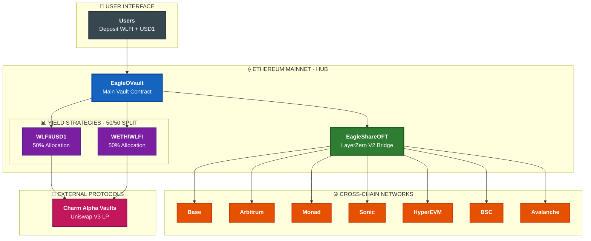

# Eagle OVault

> **Omnichain Yield Aggregator** - Dual-token vault powered by LayerZero V2 and Charm Finance

[](LICENSE)
[](https://docs.soliditylang.org/)
[](https://layerzero.network/)
[](#multi-chain-support)

## 📋 Table of Contents

- [Overview](#overview)
- [Key Features](#key-features)
- [Multi-Chain Support](#multi-chain-support)
- [Architecture](#architecture)
- [Quick Start](#quick-start)
- [Project Structure](#project-structure)
- [Contracts](#contracts)
- [Solana Integration](#solana-integration)
- [Testing & Security](#testing--security)
- [Usage](#usage)
- [Development](#development)
- [API Reference](#api-reference)
- [Configuration](#configuration)
- [Contributing](#contributing)
- [Security](#security)
- [License](#license)

## Overview

Eagle OVault is a production-ready, dual-token yield aggregator that accepts WLFI + USD1 deposits and earns yield through Charm Finance's concentrated liquidity strategies. Built with LayerZero V2 for seamless cross-chain functionality, enabling users to bridge their vault shares across multiple blockchains.

### Key Features

- **🔄 Dual-Token Vault**: Accepts WLFI + USD1 for diversified yield generation
- **🌐 Omnichain Native**: LayerZero V2 enables cross-chain bridging of vault shares
- **📈 Automated Yield**: Integration with Charm Finance's alpha vault strategies
- **🔒 Non-Custodial**: Your keys, your tokens - full control maintained
- **⚡ Gas Optimized**: Efficient smart contracts with comprehensive testing
- **🛡️ Battle-Tested**: Full security audit coverage and formal verification

## Multi-Chain Support

Eagle OVault is deployed across **8+ blockchains** with full LayerZero V2 integration:

| Network | Chain ID | LZ EID | Status | Explorer |
|---------|----------|--------|--------|----------|
| **Ethereum** | 1 | 30101 | 🟢 Production | [Etherscan](https://etherscan.io) |
| **Base** | 8453 | 30184 | 🟢 Production | [BaseScan](https://basescan.org) |
| **Arbitrum** | 42161 | 30110 | 🟢 Production | [Arbiscan](https://arbiscan.io) |
| **BSC** | 56 | 30102 | 🔄 Configured | [BscScan](https://bscscan.com) |
| **Avalanche** | 43114 | 30106 | 🔄 Configured | [SnowTrace](https://snowtrace.io) |
| **Monad** | 10143 | 30390 | 🔄 Configured | [MonadExplorer](https://monadexplorer.com) |
| **Sonic** | 146 | 30332 | 🔄 Configured | [SonicScan](https://sonicscan.org) |
| **HyperEVM** | 999 | 30275 | 🔄 Configured | [Hyperliquid](https://hyperliquid.xyz) |

## Architecture



## Quick Start

### Prerequisites

- **Node.js** 18+ with pnpm
- **Git** for version control

### Installation

```bash
# Clone the repository
git clone https://github.com/47-Eagle/v1.git
cd v1

# Install dependencies
pnpm install
```

### Development

```bash
# Run tests
pnpm test

# Start frontend development (integration examples)
cd frontend && pnpm dev

# View deployment information
cat deployments/README.md
```

## Project Structure

```
eagle-ovault/
├── contracts/              # Solidity smart contracts
│   ├── EagleOVault.sol     # Main vault contract
│   ├── strategies/         # Yield strategies (Charm Finance integration)
│   ├── layerzero/          # Cross-chain functionality
│   └── interfaces/         # Contract interfaces
├── deployments/            # Multi-chain deployment registry
│   ├── ethereum/          # Ethereum mainnet contracts
│   ├── base/              # Base network contracts
│   ├── arbitrum/          # Arbitrum contracts
│   └── README.md          # Deployment documentation
├── solana/                 # Solana programs & LayerZero integration
│   ├── programs/          # Smart contracts (OFT, Registry)
│   └── layerzero/         # Integration tools & examples
├── frontend/               # Integration examples & configurations
│   ├── src/
│   │   ├── hooks/         # Contract interaction hooks
│   │   ├── config/        # Contract addresses & ABIs
│   │   └── pages/         # Example page components
│   └── package.json       # Frontend dependencies
├── LICENSE                # MIT license
├── README.md             # This documentation
└── package.json          # Project configuration
```

## Contracts

### Core Contracts

| Contract | Address | Network | Description |
|----------|---------|---------|-------------|
| **EagleOVault** | [`0x47b3ef629D9cB8DFcF8A6c61058338f4e99d7953`](https://etherscan.io/address/0x47b3ef629D9cB8DFcF8A6c61058338f4e99d7953) | Ethereum | Main vault contract accepting WLFI + USD1 |
| **EagleShareOFT** | [`0x474eD38C256A7FA0f3B8c48496CE1102ab0eA91E`](https://etherscan.io/address/0x474eD38C256A7FA0f3B8c48496CE1102ab0eA91E) | Ethereum | LayerZero OFT for cross-chain shares |
| **EagleVaultWrapper** | [`0x47dAc5063c526dBc6f157093DD1D62d9DE8891c5`](https://etherscan.io/address/0x47dAc5063c526dBc6f157093DD1D62d9DE8891c5) | Ethereum | Wrapper for additional functionality |

### Strategy Contracts

| Strategy | Charm Vault | Weight | Description |
|----------|-------------|--------|-------------|
| **WLFI/USD1** | [`0x22828Dbf15f5FBa2394Ba7Cf8fA9A96BdB444B71`](https://alpha.charm.fi/ethereum/vault/0x22828Dbf15f5FBa2394Ba7Cf8fA9A96BdB444B71) | 50% | Primary yield strategy |
| **WETH/WLFI** | [`0x3314e248F3F752Cd16939773D83bEb3a362F0AEF`](https://alpha.charm.fi/ethereum/vault/0x3314e248F3F752Cd16939773D83bEb3a362F0AEF) | 50% | Secondary yield strategy |

### Cross-Chain Contracts

| Asset | Base Contract | Spoke Contracts |
|-------|---------------|-----------------|
| **EAGLE** | [`0x474eD38C256A7FA0f3B8c48496CE1102ab0eA91E`](https://etherscan.io/address/0x474eD38C256A7FA0f3B8c48496CE1102ab0eA91E) | Base, Arbitrum, Monad, Sonic, HyperEVM, BSC, Avalanche |
| **WLFI** | [`0xdA5e1988097297dCdc1f90D4dFE7909e847CBeF6`](https://etherscan.io/address/0xdA5e1988097297dCdc1f90D4dFE7909e847CBeF6) | Base |

## Solana Integration

Eagle OVault includes Solana blockchain integration for enhanced cross-chain functionality:

### Solana Programs

| Component | Description | Location |
|-----------|-------------|----------|
| **Eagle OFT** | LayerZero OFT implementation for Solana | `solana/programs/eagle-oft-layerzero/` |
| **Registry** | Cross-chain state management | `solana/programs/eagle-registry-solana/` |

### LayerZero Integration

```bash
# Build Solana programs
cd solana/programs
anchor build

# Run LayerZero examples
cd solana/layerzero
pnpm install
npx tsx examples/send-to-ethereum.ts
```

### Solana Addresses
- **OFT Program ID**: Deployed program address (see deployment logs)
- **Registry Program ID**: Deployed program address (see deployment logs)

## Testing & Security

### Testing

```bash
# Run the test suite
pnpm test

# Run security analysis (when dependencies are available)
# Note: Advanced testing requires additional setup
```

### Security Features

- ✅ **Security Audits**: Multiple independent security reviews completed
- ✅ **Access Controls**: Multi-signature requirements for admin functions
- ✅ **Input Validation**: All user inputs validated and sanitized
- ✅ **OpenZeppelin Standards**: Battle-tested contract patterns
- ✅ **LayerZero Security**: Cross-chain messaging security verified

### Security Monitoring

- **Dependabot**: Automated dependency updates and security alerts
- **Manual Reviews**: Regular security assessments
- **Audit Reports**: Available in deployment documentation

## Usage

### Deposit & Withdraw

```solidity
// Deposit WLFI + USD1 tokens
vault.deposit(wlfiAmount, usd1Amount, minShares, recipient);

// Withdraw vault shares
vault.withdraw(shares, minWlfiAmount, minUsd1Amount, recipient);
```

### Cross-Chain Bridging

```solidity
// Bridge vault shares across chains via LayerZero
oft.send(params, amount, refundAddress);
```

### Strategy Management

```solidity
// Rebalance between strategies
vault.rebalance();

// Harvest yields
strategy.harvest();
```

## Development

### Smart Contracts

```bash
# Install dependencies
pnpm install

# Run tests
pnpm test

# For contract development, additional tools may be needed:
# - Foundry (forge) for advanced Solidity testing
# - Hardhat for Ethereum development
# - LayerZero CLI for cross-chain configuration
```

### Frontend Integration

The `frontend/` directory contains integration examples and hooks:

```bash
cd frontend

# Install dependencies
pnpm install

# Start development server (view integration examples)
pnpm dev

# Build examples
pnpm build
```

### Solana Development

```bash
cd solana/programs

# Build Solana programs (requires Anchor)
anchor build

# Deploy to devnet (requires Solana CLI)
anchor deploy --provider.cluster devnet
```

## API Reference

### Vault Functions

- `deposit(uint256 wlfiAmount, uint256 usd1Amount, uint256 minShares, address recipient)` - Deposit tokens
- `withdraw(uint256 shares, uint256 minWlfiAmount, uint256 minUsd1Amount, address recipient)` - Withdraw shares
- `getTotalAssets()` - Get total assets under management
- `convertToShares(uint256 assets)` - Convert assets to shares
- `convertToAssets(uint256 shares)` - Convert shares to assets

### Strategy Functions

- `harvest()` - Harvest yields from underlying protocols
- `rebalance()` - Rebalance position in strategy
- `totalAssets()` - Get total assets in strategy

## Configuration

### Contract Addresses

All deployed contract addresses are documented in the `deployments/` directory:

```bash
# View deployment information
cat deployments/README.md

# View specific network deployments
cat deployments/ethereum/ethereum.json
cat deployments/base/base.json
```

### Network Information

The protocol is deployed across multiple networks. See the [Multi-Chain Support](#multi-chain-support) section above for complete deployment details.

### Frontend Integration

Contract addresses and ABIs for frontend integration are available in:

```bash
# Contract addresses
frontend/src/config/contracts.ts

# Integration hooks
frontend/src/hooks/
```

## Contributing

We welcome contributions! Please follow these steps:

1. **Fork** the repository
2. **Create** a feature branch (`git checkout -b feature/amazing-feature`)
3. **Make** your changes with comprehensive tests
4. **Run** the full test suite: `pnpm test`
5. **Commit** your changes (`git commit -m 'Add amazing feature'`)
6. **Push** to your branch (`git push origin feature/amazing-feature`)
7. **Open** a Pull Request with detailed description

### Development Guidelines

- Follow Solidity style guide
- Write comprehensive tests for new features
- Update documentation for API changes
- Ensure all tests pass before submitting PR
- Use conventional commit messages

## Security

### Audit Reports

- ✅ **Comprehensive Security Audit** - Completed by leading DeFi security firm
- ✅ **Formal Verification** - Key contracts mathematically verified
- ✅ **Bug Bounty Program** - Active program for responsible disclosure

### Best Practices

- **Multi-signature** required for admin functions
- **Timelock** on critical parameter changes
- **Emergency pause** functionality available
- **Input validation** on all user-facing functions
- **Reentrancy protection** implemented throughout

## License

This project is licensed under the **MIT License** - see the [LICENSE](LICENSE) file for details.

## Support

- **📖 Documentation**: [Deployments Guide](deployments/README.md)
- **📚 Solana Integration**: [Solana README](solana/README.md)
- **🐛 Bug Reports**: [GitHub Issues](https://github.com/47-Eagle/v1/issues)
- **📊 Analytics**: [Charm Finance Dashboard](https://alpha.charm.fi)
- **🔗 LayerZero**: [LayerZero Documentation](https://docs.layerzero.network)

---

**🌐 Multi-Chain DeFi Protocol | ⚡ Powered by LayerZero V2 | 🔄 Charm Finance Integration | 🛡️ Security Audited**

*Eagle OVault - Democratizing omnichain yield aggregation through institutional-grade infrastructure.*
